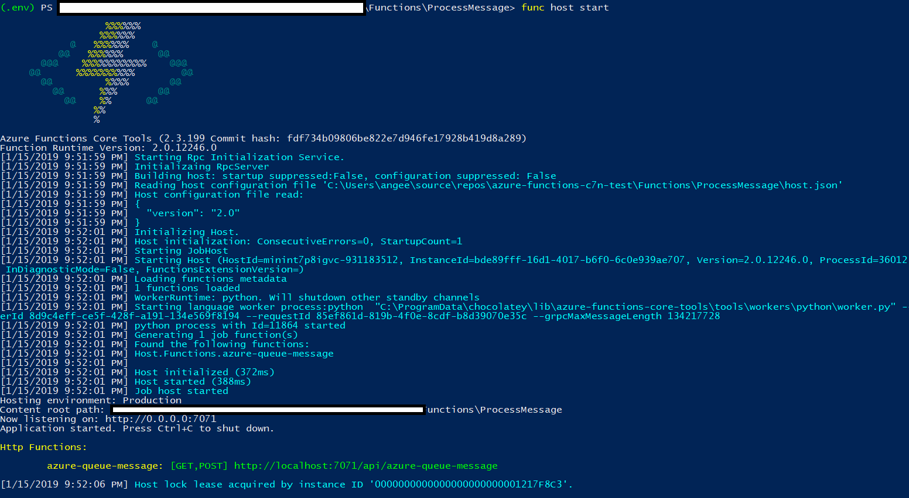

# azure-functions-c7n-test

This will be a test environment for running Python 3.6 in Azure Functions.

## Helpful Links

1. [Create a Python Function App](https://docs.microsoft.com/en-us/azure/azure-functions/functions-create-first-function-python)
1. [Working with Azure Functions](https://docs.microsoft.com/en-us/azure/azure-functions/functions-run-local#v2)
1. [Create a function app](https://docs.microsoft.com/en-us/azure/azure-functions/functions-cli-samples#create)]
1. [Create function app for Serverless](https://docs.microsoft.com/en-us/azure/azure-functions/scripts/functions-cli-create-serverless)
1. [Cloud Custodian](https://github.com/cloud-custodian/cloud-custodian/)

## Clone C7n

> We're going want to use this in conjunction with this PR until it's merged: https://github.com/cloud-custodian/cloud-custodian/pull/3497

We're going to assume that we have a local copy of the custodian project.

```powershell
git clone https://github.com/cloud-custodian/cloud-custodian/
```

We can also assume we'll have a policy folder for testing.

## Build the image
Navigate to the docker folder and build the image.  This will assume Docker is configured for Linux Containers.

```powershell
docker build -t <myrepo>/cloud-custodian-python36 .
```

## Running the image

Assuming we have Docker installed, we can run the image (in Linux Containers).

```powershell
docker run -it myplooploops/cloud-custodian-python36 -v <localpath-custodian>:/cloud-custodian -v <localpath-policies>:/policies -v <localpath-functions>:/functions
```

Navigate to the functions folder and then make a test function.  This will create a **function app folder** which we can populate with additional **functions**.

In bash, we can also enter the virtual environment and check that we can create a new function app.

```bash
cd /functions

python3.6 -m venv .env
source .env/bin/activate

func init myfuncproj
```

In powershell, we can also enter the virtual environment and check that we can create a new function app.

```powershell
cd .\functions

# In PowerShell
py -3.6 -m venv .env
.env\scripts\activate

func init myfuncproj
```

We can also login using az cli:

```bash
az login
az account set -s 'account id'
```

## Using Azure Functions for Python
We can refer to this [guide for python functions](https://docs.microsoft.com/en-us/azure/azure-functions/functions-create-first-function-python) for the next steps.

### Creating a function

This will let us create a new **trigger based function** to add to the function app.

```bash
func new
```

We can pick an **HTTP trigger** for now.


### Run A function locally

Assuming that we've created a function to stick in function app, we can test it locally by spinning up the function core tools host.  We'll want to be in the **working directory** for the function app.

```bash
func host start
```



### Publishing

We'll assume that we've already logged into our Azure Sub.

We'll also want to make sure we've [created a function app](https://docs.microsoft.com/en-us/azure/azure-functions/functions-cli-samples#create), so we could try the [serverless approach path](https://docs.microsoft.com/en-us/azure/azure-functions/scripts/functions-cli-create-serverless).

```bash
#!/bin/bash

# Function app and storage account names must be unique.
storageName=mystorageaccount$RANDOM
functionAppName=myserverlessfunc$RANDOM

# Create a resource group.
az group create --name myResourceGroup --location westeurope

# Create an Azure storage account in the resource group.
az storage account create \
  --name $storageName \
  --location westeurope \
  --resource-group myResourceGroup \
  --sku Standard_LRS

# Create a serverless function app in the resource group.
az functionapp create \
  --name $functionAppName \
  --storage-account $storageName \
  --consumption-plan-location westeurope \
  --resource-group myResourceGroup \
  --os-type Linux \
  --runtime python
  ```

> Note that we'll want to make sure that the runtime also matches.  So for instance, we'll want to make sure to publish a **python** app to a **python** runtime.  We'll also want to use the **--os-type Linux** and **--runtime python** flags.

[Publish to a Function App](https://docs.microsoft.com/en-us/azure/azure-functions/functions-run-local#publish)

The function app name will be the name of the created app.  We'll also want to point to the directory that has the **host.json** file.  For reference, we can look at the [host.json](./Functions/ProcessMessage/host.json).

Before publishing, we may also need to set the permissions for a /tmp folder.

> Note these are overly permissive and just used for dev/testing purposes.

```bash
chmod -R 777 /tmp
chmod g+s /tmp
setfacl -d -m g::rwx /tmp
```

We can also test that the download will work.

```bash
pip download -r /functions/ProcessMessage/requirements.txt --dest /tmp/azureworkerx2_lxfox
```

Assuming that we're able to write to the **/tmp folder** and able to resolve the python dependencies through **pip download**, we can attempt to publish to the **existing python function app**.

> Make sure that we've already activated the virtual environment for python 3.6.

```bash
func azure functionapp publish <FunctionAppName>
```

### Helpful Function Commands

This will list the functions that are part of a given function app in azure.
```bash
func azure functionapp list-functions <functionapp>
```

func azure functionapp list-functions andy-fa-python-test

## A note on Cloud Custodian

We also have the c7n environment, which we can refer to [Cloud Custodian](http://cloudcustodian.io) and its [github repo](https://github.com/cloud-custodian/cloud-custodian).

