# Approach

We're going to set up a Logic App to hook into other messaging services for Cloud Custodian.

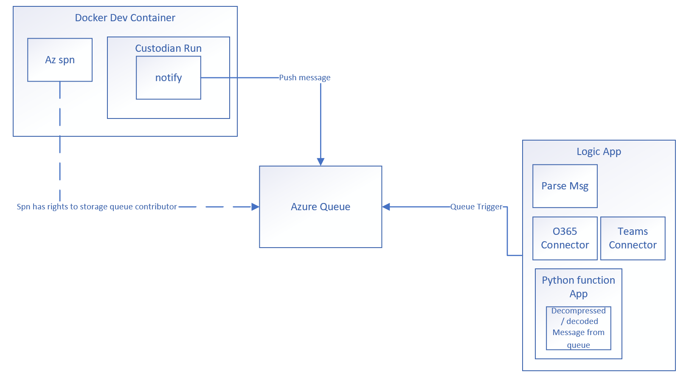

After applying a Custodian policy, we're going to process Azure queue messages with a Logic App.  We'll use a python azure function to help process the message into JSON for the subsequent workflow in Logic Apps.

Then we can use some of the built-in connectors in Logic Apps as an experiment.  In this case, we can use the O365 Connector and Teams Connector.

The resulting logic app should look like the following:

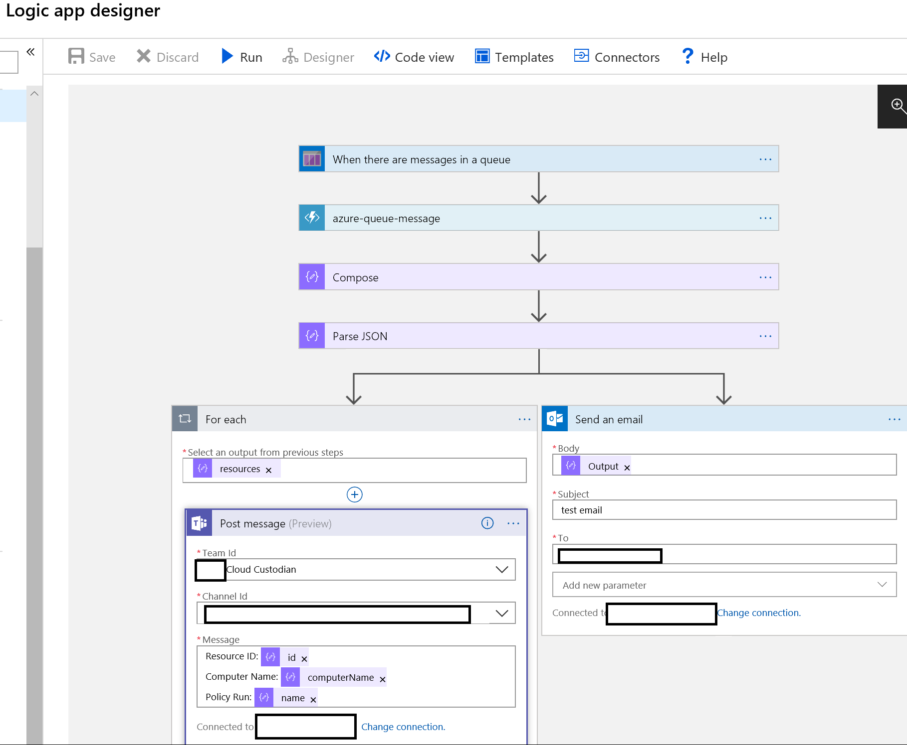

## Helpful Links

1. [Cloud Custodian](https://github.com/cloud-custodian/cloud-custodian)
1. [Getting started with Logic Apps](https://docs.microsoft.com/en-us/azure/logic-apps/quickstart-create-first-logic-app-workflow)
1. [Azure Functions Python Developer Guide](https://docs.microsoft.com/en-us/azure/azure-functions/functions-reference-python)
1. [Docker Volumes](https://docs.docker.com/storage/volumes/)
1. [Docker for Windows](https://docs.docker.com/docker-for-windows/install/#switch-between-windows-and-linux-containers)
1. [Azure Queues](https://docs.microsoft.com/en-us/azure/storage/queues/storage-queues-introduction)
1. [Azure Storage Explorer](https://azure.microsoft.com/en-us/features/storage-explorer/)
1. [Install Az Cli](https://docs.microsoft.com/en-us/cli/azure/install-azure-cli?view=azure-cli-latest)

## Set up Environment

### Repo
We'll  want to pull in some modifications to custodian here:

https://github.com/cloud-custodian/cloud-custodian/pull/3497

### Docker environment for Custodian

We can use the docker image that has cloud custodian and python set up.  We'll also want to make sure we can map to the git repo via volume mount.  We'll also volume mount for the policies.

> Make sure that we're using Docker in Linux mode.  Also be careful with the volume mount paths.  If there's trouble picking up the volume mount, we can try restarting docker as well.

```powershell
docker run -it -v <repopath>:/cloud-custodian <policiespath>:/policies aluong24/cloud-custodian-python36
```

Inside the running container, we'll want to swap out the built-in libraries for c7n and c7n_azure so we can use the modified versions.  We'll also pull in vim and sudo.

> This assumes that we've named the folder for the source 'cloud-custodian' in the volume mount.

```
pip uninstall c7n_azure
pip uninstall c7n

cd cloud-custodian
/cloud-custodian# pip install -e .
/cloud-custodian# pip install -e tools/c7n_azure

apt-get install vim
apt-get install sudo
```

Make sure to log into to Azure.  The context for the login should have rights to push to Azure Queue.  If it's not in the container, be sure to [install Az Cli](https://docs.microsoft.com/en-us/cli/azure/install-azure-cli?view=azure-cli-latest).

```az cli
az login
```

We can also point to an example policy.
[Find VMs sample](../sample-policies/find-vms.yaml).

In this policy, we'd like to just find vms and then notify the queue.

> Policies can support additional actions, filters, and tags.  We're just keeping it simple for now.  See the other sample policies for examples.

We'll want to update the **queue** URL in the transport section.

We'll also want to make sure that we're setting the **encode_ascii** to **False** for our test.

### Set up Azure Queue

We can set up an Azure Queue.  We'll set up the queue's storage account first.

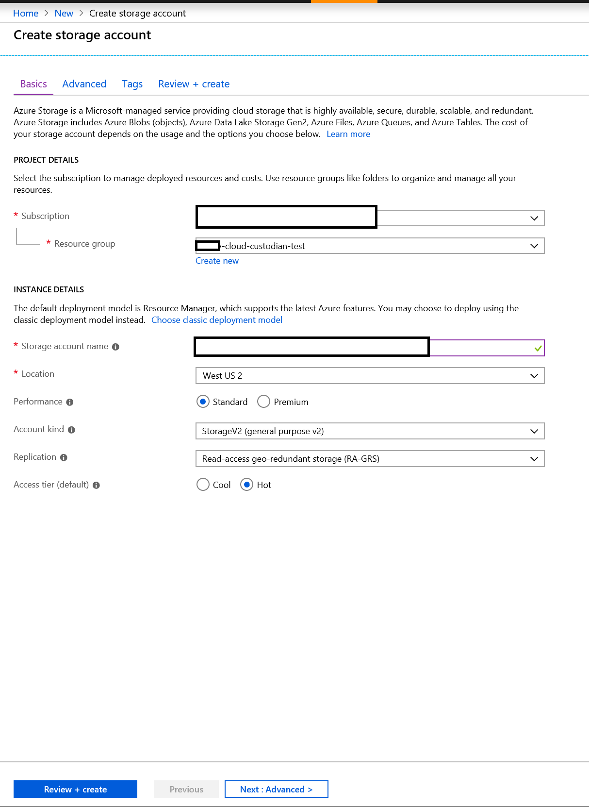

We'll create a queue.  Note that the Queue URL will be used in the policy.

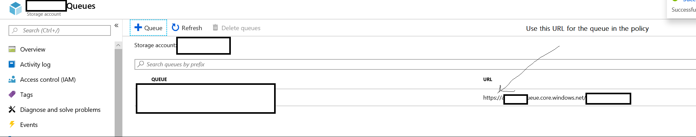

Set queue permissions to the logged in context (SPN, azure from az cli) that will push messages into the queue.

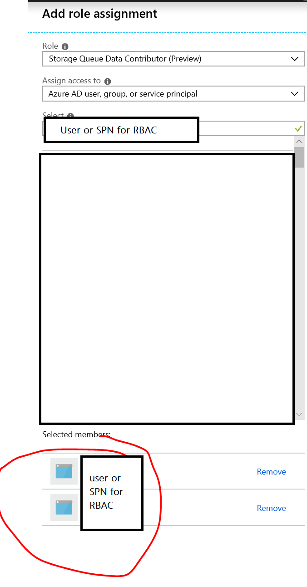

### Send a queue message

Assuming that we've configured the queue settings in the policy and that the custodian codebase will pack the message for consumption by the logic app, we can test out the send.

> This assumes that we're in the volume mounted folder for the policy in the custodian docker environment.

```
custodian run -s . find-vms.yaml
```

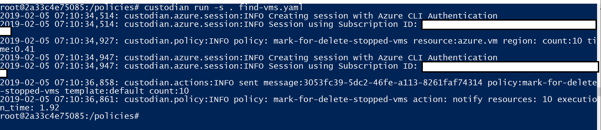


Upon submitting a policy (through custodian run), we can see that the queue contains a message.  We can check in storage explorer to see the message details.

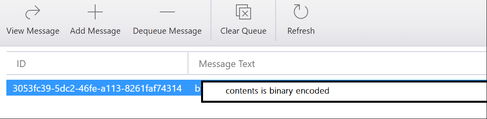

### Set up Azure Function with Python

Please see the following for setting up our
[python Azure Function](../README.md)

Note that this sample contains the example for processing a queue message.

### Set up Azure Logic App

We'll want to set up a new logic app that will consume from the queue.

We can use the built-in connector for Azure Logic Apps for Azure Queues.  We'll point to the queue that we submitted our message to earlier.

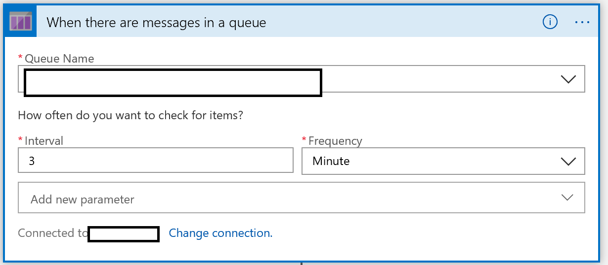

We'll send the contents of the message text to our python function that we've deployed.

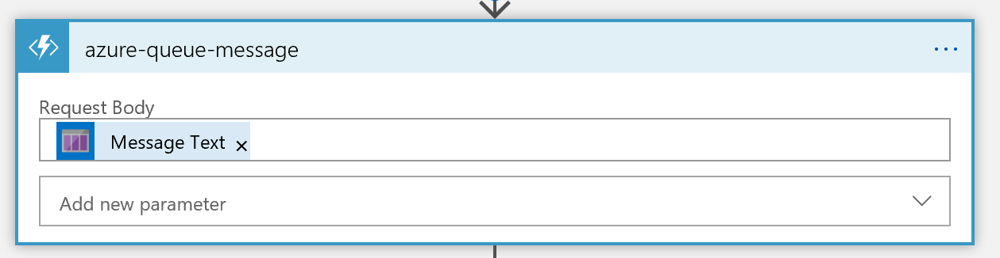

Once we receive the JSON payload back, we can use logic apps to handle it in the workflow.  In this case, we'll use the compose connector to 'pass-through' the value, and the parse json action to pull out values from the json.

> Use sample payload to generate schema is pretty handy.  We can pass it the sample json that we receive from the function should we run the step and successfully pull back the json.

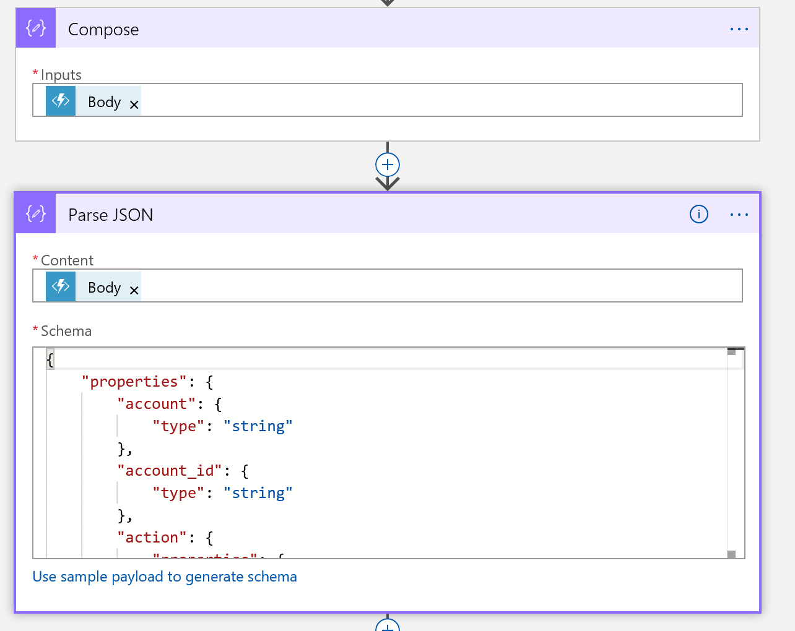

We can then notify the appropriate folks using the connectors.

In this case, we can post a message to teams or send an email using the Office 365 connector.  However, there's other options available with Logic Apps too.

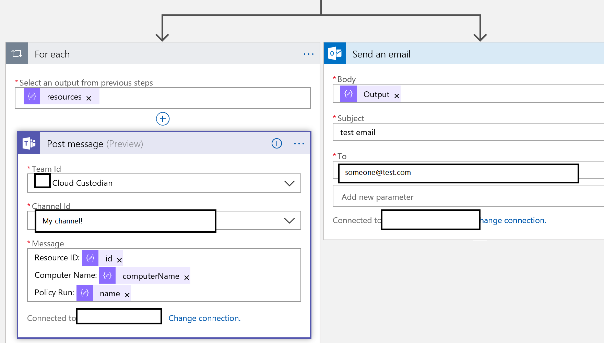

Revisiting the approach, our workflow should look like this:


We can click the **run** button to test that the logic app will pick up the messages.

### Results

Post to Teams.

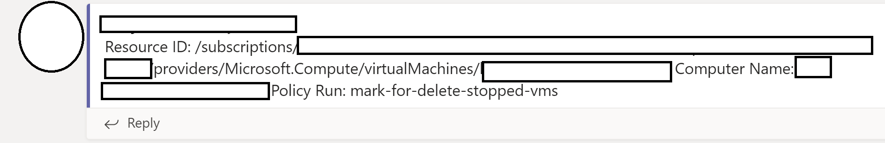

Sent an Email.

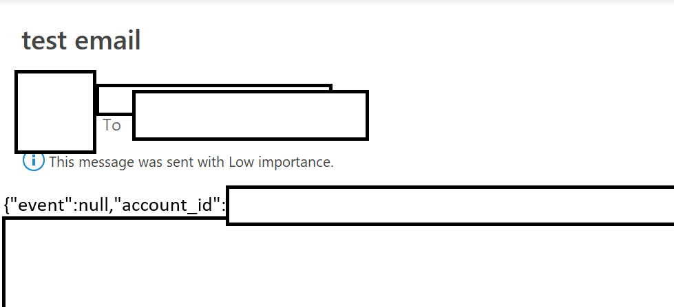

After running these tests, clean up the Azure resources.  We can also disable the Logic App too in case we'd like to keep the workflow for a future use.


